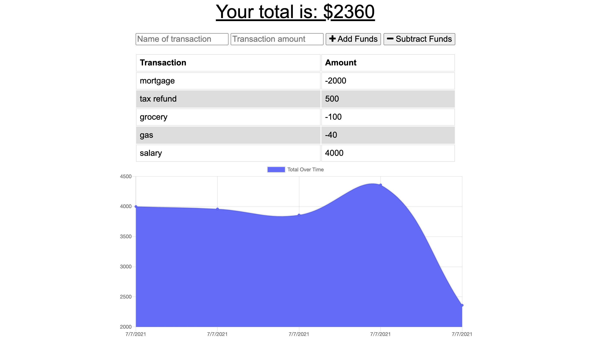
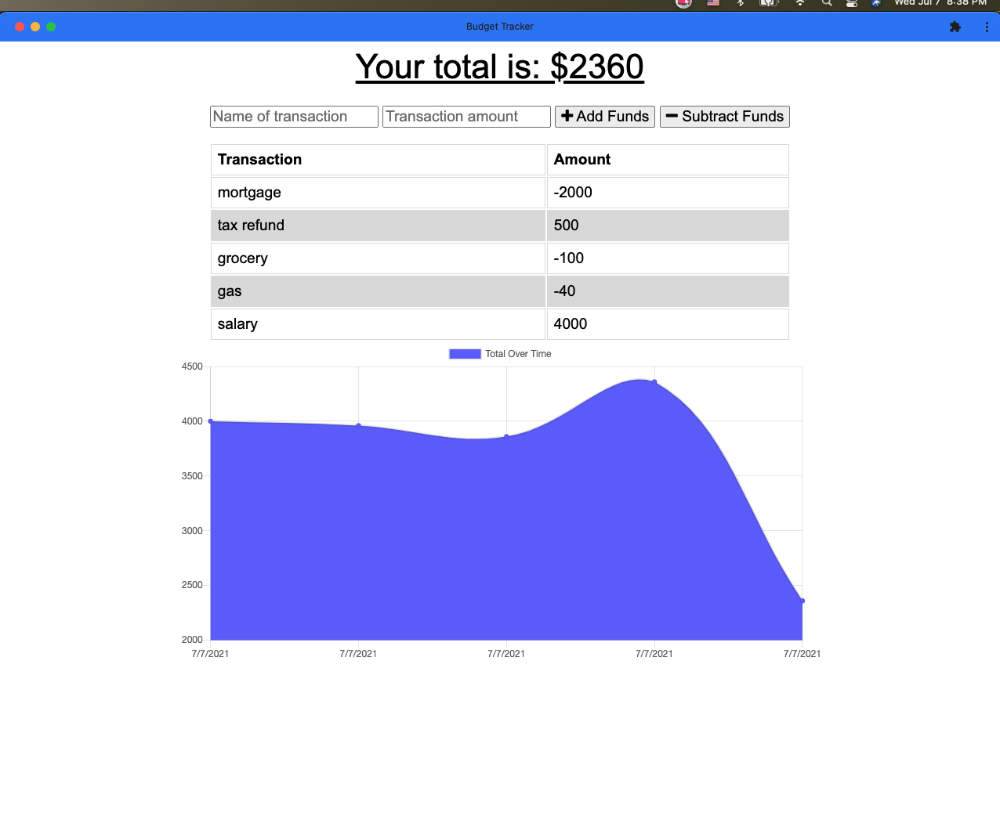

# budget-tracker

## Description 

This is simple one page application that allows users to keep track of their expenses even in offline mode. If user doesn't have internet connection, all transcations will be stored in IndexedDB and as soon as connection is back up all records will be saved to mongo database. User can also install it as a desktop application.

## Application Display  

View Application in Heroku - [Here](https://safe-savannah-89439.herokuapp.com/)

Preview of Application:

## Tools 

* MongoDB, Mongoose, IndexedDB
* Node.js, Express.js
* HTML, CSS, JavaScript
* Webpack

## License

Copyright © 2021 